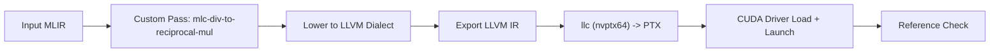

# MLIR Softmax Backend (C++ / MLIR / LLVM / PTX / CUDA Driver)

A complete end-to-end compiler backend that takes MLIR input through a full pipeline:

`MLIR input -> custom optimization pass -> LLVM dialect -> LLVM IR -> PTX -> CUDA Driver kernel launch`

## What this project demonstrates

- **Full compiler pipeline**: MLIR parse, optimization, multi-dialect lowering, LLVM IR export, NVPTX codegen, and GPU kernel execution — all in C++17.
- **Custom MLIR pass**: Loop-invariant code motion (LICM) for floating-point division, replacing in-loop `arith.divf` with a hoisted reciprocal and `arith.mulf`. This is a standard strength reduction optimization.
- **CUDA Driver API integration**: Dynamic loading of libcuda.so, PTX JIT compilation, device memory management, and kernel launch — works on native Linux and WSL2.
- **Testing infrastructure**: FileCheck unit tests, end-to-end pipeline tests, GPU correctness verification, and benchmarking with CTest.

## Custom Optimization Pass

**Pass:** `mlc-div-to-reciprocal-mul`

Standard LICM + division strength reduction:
- Detects loop-invariant denominators in `scf.for` loops.
- Hoists `1.0 / denom` (reciprocal) outside the loop.
- Replaces in-loop `arith.divf %x, %denom` with `arith.mulf %x, %recip`.

### Before (baseline)
```mlir
scf.for %i = %c0 to %c1024 step %c1 {
  %x = memref.load %input[%i] : memref<1024xf32>
  %y = arith.divf %x, %sum : f32
  memref.store %y, %output[%i] : memref<1024xf32>
}
```

### After (optimized)
```mlir
%recip = arith.divf %one, %sum : f32
scf.for %i = %c0 to %c1024 step %c1 {
  %x = memref.load %input[%i] : memref<1024xf32>
  %y = arith.mulf %x, %recip : f32
  memref.store %y, %output[%i] : memref<1024xf32>
}
```

For a loop of N iterations, this reduces N divisions to 1 division + N multiplications.

## Project Pipeline


## Build

```bash
# Linux / WSL2 with LLVM 15
cmake -S . -B build -G Ninja \
  -DLLVM_DIR=/usr/lib/llvm-15/lib/cmake/llvm \
  -DMLIR_DIR=/usr/lib/llvm-15/lib/cmake/mlir
cmake --build build -j

# macOS with Homebrew LLVM
cmake -S . -B build -G Ninja \
  -DLLVM_DIR=/opt/homebrew/opt/llvm/lib/cmake/llvm \
  -DMLIR_DIR=/opt/homebrew/opt/llvm/lib/cmake/mlir
cmake --build build -j
```

## Tests
```bash
ctest --test-dir build --output-on-failure
```

Includes:
- FileCheck validation for the custom pass.
- End-to-end pipeline test (baseline vs optimized artifact generation).
- GPU correctness harness (`mlc-demo` with `--verify`).
- Benchmark shape contract test.

## End-to-End Driver
```bash
./build/tools/mlc-driver/mlc-driver \
  --input examples/softmax.mlir \
  --output-dir build/artifacts \
  --mode optimized
```

## Demo (PTX Load + CUDA Launch + Verify)
```bash
./build/tools/mlc-demo/mlc-demo \
  --input examples/softmax.mlir \
  --verify
```

On systems without an NVIDIA GPU or CUDA driver, the demo exits with a `SKIP` message.

## Benchmark
```bash
./build/bin/softmax-benchmark \
  --shapes=64x64,64x128,128x128,128x256,256x256,256x512,512x512,512x1024,1024x1024,2048x1024
```

The benchmark counts actual `arith.divf` operations in the IR before and after the optimization pass, and measures pass execution time.

## Repository Map
- `lib/Passes/`: custom MLIR optimization pass.
- `compiler/pipeline/`: staged lowering and PTX emission pipeline.
- `runtime/`: CUDA Driver runtime wrapper (dynamic libcuda.so loading).
- `tools/mlc-opt`: pass runner.
- `tools/mlc-driver`: end-to-end pipeline driver.
- `tools/mlc-demo`: GPU demo + numerical verification.
- `benchmarks/`: benchmark harness.
- `test/` and `tests/`: FileCheck and integration tests.
