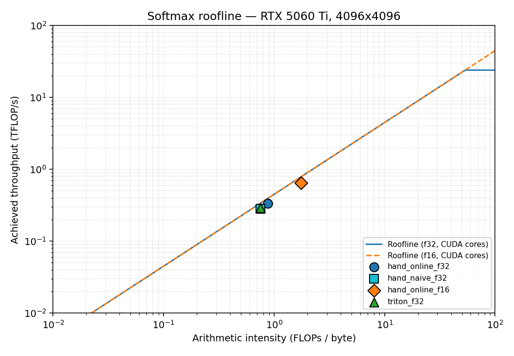

# Roofline: softmax on RTX 5060 Ti, 4096 x 4096



This roofline covers the hand CUDA and Triton baseline kernels. These
operating points are not generated by the current MLIR pipeline; they set
the target for future MLIR-emitted row-wise softmax kernels.

Ceilings:
- Peak DRAM bandwidth: **448 GB/s** (GDDR7, 128-bit bus)
- Peak f32 FMA compute: **~24 TFLOP/s** (RTX 5060 Ti CUDA cores, no tensor cores)
- Peak f16 FMA compute: **~48 TFLOP/s** (CUDA cores, ignoring tensor cores
  — softmax cannot use tensor cores without reformulation)

Operating points taken from [`results.json`](../results.json); arithmetic
intensity is per-element, computed from the theoretical DRAM traffic
(`2 * bytes_per_elem` for the online kernels — one read + one write — and
inflated for the three-pass naive kernel to reflect the extra traversal).

| Backend            | AI (FLOPs/byte) | Achieved TFLOP/s | DRAM GB/s | % peak BW |
|--------------------|----------------:|-----------------:|----------:|----------:|
| `hand_online_f32`  |            0.88 |             0.33 |       380 |     84.9% |
| `hand_naive_f32`   |            0.75 |             0.27 |       374 |     83.5% |
| `hand_online_f16`  |            1.75 |             0.65 |       371 |     82.9% |
| `triton_f32`       |            0.75 |             0.29 |       385 |     85.9% |

## Where things sit on the plot

Every backend is on the **memory-bound diagonal** of the roofline, well
below the compute ceiling. Concretely, each point sits within ~1 dB of the
DRAM roof. This is what we expect for softmax: the algorithmic intensity is
<2 FLOPs/byte regardless of implementation, and the 5060 Ti can do ~54
FLOPs/byte when purely compute-bound. There is no refactoring that makes
this workload compute-bound on this GPU short of fusing softmax into a
downstream matmul (e.g. FlashAttention's approach).

## What to take away

1. **The bandwidth ceiling, not the algorithm, picks the winner.** Online
   vs three-pass naive, Triton vs hand-CUDA — at 4096x4096 all four land
   within 4 percentage points of each other. The online kernel's
   theoretical 1.5x bandwidth reduction (2 passes vs 3) is eroded by L2
   hits on the second pass — ncu shows a 28% L2 hit rate for the
   `hand_online_f32` kernel.
2. **f16 gives a real 2x win.** The `hand_online_f16` point sits at 1.75
   FLOPs/byte vs 0.88 for f32. Same DRAM bandwidth, half the bytes moved,
   so twice the useful compute at the same throughput ceiling. Duration
   drops from 329 us to 145 us — within a few percent of the expected
   2x speedup.
3. **This is as fast as these kernels can go on this GPU.** To go further
   without changing the problem would require dropping to a lower
   numerical precision (bf16/int8 with quantization-aware scaling) or
   moving the kernel fusion boundary outwards (FlashAttention-style fused
   attention).

## Reproducing the plot

```bash
python -m pip install matplotlib
python -m benchmarks.softmax_gpu_bench --json docs/results.json
python docs/profiling/make_roofline.py
```
